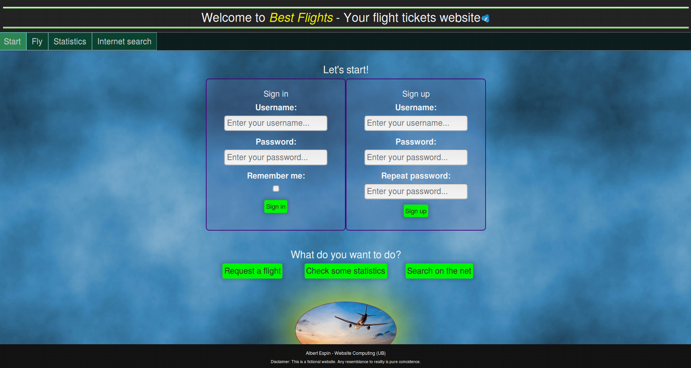

# Web Application to buy Flight Tickets

Web application to (simulatedly) buy flight tickets. It uses PHP in the backend, Javascript (standard, JQuery and Scriptaculous) for the frontend and AJAX for communication. HTML, CSS and Bootstrap are used to define the appearance of the pages, and SQL for data storage.

| | |
|-|-|
| **Language**   | Spanish (report), English (UI) |
| **Author** | Albert Espín |
| **Date**  | February-May 2018  |
| **License** |  Creative Commons Attribution, Non-Commercial, Non-Derivative |

## Image Gallery

